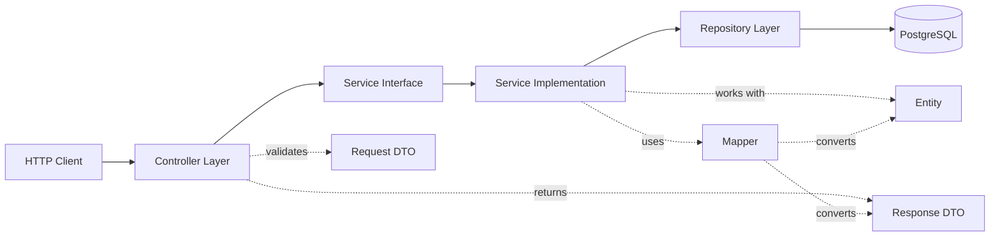

# Vima Insurance Admin Backend - Tech Stack & Code Patterns

> **Purpose**: Reference guide for all developers working on the Vima Insurance Admin Backend
> **Last Updated**: February 4, 2026
> **Audience**: Backend developers, QA engineers, DevOps

---

## 1. Technology Stack

### Core Technologies
| Component | Technology | Version | Purpose |
|-----------|-----------|---------|---------|
| **Language** | Java | 21 | Primary programming language |
| **Framework** | Spring Boot | 3.4.6 | Application framework |
| **Build Tool** | Maven | - | Dependency management & build |
| **Database** | PostgreSQL | - | Primary data store |
| **ORM** | Hibernate/JPA | - | Object-relational mapping |

### Spring Ecosystem
| Component | Technology | Version | Purpose |
|-----------|-----------|---------|---------|
| **Web** | Spring Web MVC | 3.4.6 | REST API development |
| **Security** | Spring Security | 3.4.6 | Authentication & authorization |
| **Data** | Spring Data JPA | 3.4.6 | Database access layer |
| **Validation** | Spring Validation | 3.4.6 | Input validation |
| **Mail** | Spring Mail | 3.4.6 | Email functionality |

### Security & Authentication
| Component | Technology | Version | Purpose |
|-----------|-----------|---------|---------|
| **JWT** | jjwt-api, jjwt-impl | 0.11.5 | Token generation & validation |
| **OAuth2** | Spring OAuth2 Client | 3.4.6 | OAuth2 integration (Authentik) |
| **Password Hashing** | BCrypt | Built-in | Secure password storage |
| **Encryption** | Java Crypto API | Built-in | Token hashing, encryption |

### Database & Migrations
| Component | Technology | Version | Purpose |
|-----------|-----------|---------|---------|
| **Driver** | PostgreSQL JDBC | Latest | Database connectivity |
| **Migration** | Flyway | Latest | Database version control |
| **Schema** | JPA Annotations | - | Entity-table mapping |

### Cloud & External Services
| Component | Technology | Version | Purpose |
|-----------|-----------|---------|---------|
| **AWS SDK** | AWS SDK for Java | 2.22.1 | AWS services integration |
| **S3** | AWS S3 | 2.22.1 | Document storage |
| **CloudWatch** | AWS CloudWatch Logs | 2.22.1 | Log aggregation |
| **SES/SMTP** | Spring Mail | - | Email delivery |

#### Document storage (S3 key convention)

Uploaded documents are stored in S3 using an **industry-standard path** (object key):

```
{entityType}/{entityId}/{folder}/{filename}
```

| Segment | Description | Example |
|---------|-------------|---------|
| `entityType` | Lowercase entity type (organization, policy, claim, customer) | `organization` |
| `entityId` | UUID or ID of the entity | `e9499e0c-d70e-4454-a519-fbce0b9fea71` |
| `folder` | `endorsement` for endorsement/self-enrollment docs; otherwise document type (lowercase) | `endorsement` |
| `filename` | Original file name | `self_enrollment_sample.csv` |

**Example (enrollment window upload):**

`organization/e9499e0c-d70e-4454-a519-fbce0b9fea71/endorsement/self_enrollment_sample.csv`

Implementation: `DocumentServiceImpl.generateS3KeyUploadDocument()`.

### Utilities & Libraries
| Component | Technology | Version | Purpose |
|-----------|-----------|---------|---------|
| **Lombok** | Lombok | Latest | Reduce boilerplate code |
| **CSV** | OpenCSV | 5.7.1 | CSV file processing |
| **PDF** | Apache PDFBox | 2.0.31 | PDF manipulation |
| **OCR** | Tess4j | 5.10.0 | Document text extraction |
| **Excel** | Apache POI | 5.2.5 | Excel generation |
| **JSON** | org.json | 20231013 | JSON manipulation |
| **HTTP Client** | Apache HttpClient | 4.5.14 | External API calls |

### Documentation & Testing
| Component | Technology | Version | Purpose |
|-----------|-----------|---------|---------|
| **API Docs** | Springdoc OpenAPI | 2.8.3 | Swagger/OpenAPI documentation |
| **Testing** | JUnit 5 | - | Unit testing |
| **Mocking** | Mockito | - | Test mocks |
| **Auditing** | Javers | 7.9.0 | Entity change tracking |

---

## 2. Project Structure

```
src/main/java/com/vimainsurance/vimaadmin/
│
├── controller/               # REST API Controllers
│   ├── AuthController.java
│   ├── EnrollmentController.java
│   └── ...
│
├── service/                  # Service Layer Interfaces
│   ├── IAuthService.java
│   ├── IEnrollmentTokenService.java
│   └── serviceimpl/          # Service Implementations
│       ├── AuthServiceImpl.java
│       └── EnrollmentTokenServiceImpl.java
│
├── repository/               # Data Access Layer (JPA Repositories)
│   ├── IEnrollmentInvitationRepository.java
│   └── IEnrollmentSubmissionRepository.java
│
├── entity/                   # JPA Entities (Database Models)
│   ├── EnrollmentInvitation.java
│   ├── EnrollmentSubmission.java
│   └── EnrollmentWindows.java
│
├── dto/                      # Data Transfer Objects
│   ├── EnrollmentContext.java
│   ├── TokenValidationRequestDto.java
│   └── TokenValidationResponseDto.java
│
├── mapper/                   # Entity ↔ DTO Mappers
│   ├── PersonMapper.java
│   └── EnrollmentMapper.java
│
├── exception/                # Custom Exceptions
│   ├── InvalidTokenException.java
│   ├── TokenExpiredException.java
│   └── BadRequestException.java
│
├── util/                     # Utility Classes
│   ├── JwtUtil.java
│   ├── IpAddressExtractor.java
│   └── CorrelationIdFilter.java
│
├── config/                   # Spring Configuration Classes
│   ├── SecurityConfig.java
│   ├── SwaggerUIConfig.java
│   └── AppConfig.java
│
├── enums/                    # Enum Types
│   ├── EnrollementStatus.java
│   └── EndorsementSource.java
│
├── annotation/               # Custom Annotations
│   └── RateLimit.java
│
├── aspect/                   # AOP Aspects
│   └── RateLimitAspect.java
│
└── docs/                     # Documentation
    ├── enrollment-engineering-architecture.md
    └── TechDocs/
        ├── tech-stack-and-code-patterns.md
        └── token-security-implementation.md
```

---

## 3. Standard Code Flow Pattern

### The 7-Layer Architecture

For every feature, follow this pattern:



### Layer Responsibilities

#### 1. **Controller Layer** (`controller/`)
**Purpose**: Handle HTTP requests, validate input, delegate to service

```java
@RestController
@RequestMapping("/api/v1/enrollment")
@CrossOrigin(allowedHeaders = "*")
public class EnrollmentController {
    private static final Logger logger = LoggerFactory.getLogger(EnrollmentController.class);
    
    @Autowired
    private IEnrollmentTokenService tokenService;
    
    @GetMapping("/{token}/validate")
    public ResponseEntity<ResponseDto<TokenValidationResponseDto>> validateToken(
        @PathVariable String token,
        HttpServletRequest request
    ) {
        logger.info("[correlationId:{}] Token validation requested", MDC.get("correlationId"));
        
        TokenValidationResponseDto response = tokenService.validateToken(token, request);
        return ResponseEntity.ok(new ResponseDto<>(response));
    }
}
```

**Key Points:**
- Use `@RestController` for REST APIs
- Map endpoints with `@GetMapping`, `@PostMapping`, etc.
- Use `@PathVariable` and `@RequestBody` for input
- Delegate business logic to service layer
- Return `ResponseEntity<ResponseDto<T>>`
- Log with MDC correlation ID
- Use `@PreAuthorize` for authorization

---

#### 2. **Service Interface** (`service/I<Name>Service.java`)
**Purpose**: Define business operations contract

```java
public interface IEnrollmentTokenService {
    /**
     * Validates enrollment token and returns context
     * 
     * @param token Raw token from URL
     * @param request HTTP request for IP extraction
     * @return Enrollment context with JWT
     * @throws InvalidTokenException if token is invalid
     * @throws TokenExpiredException if token has expired
     */
    TokenValidationResponseDto validateToken(String token, HttpServletRequest request);
}
```

**Key Points:**
- Prefix with `I` (e.g., `IAuthService`)
- Define method signatures only
- Add Javadoc for public methods
- Declare custom exceptions in Javadoc

---

#### 3. **Service Implementation** (`service/serviceimpl/<Name>ServiceImpl.java`)
**Purpose**: Implement business logic

```java
@Service
public class EnrollmentTokenServiceImpl implements IEnrollmentTokenService {
    private static final Logger logger = LoggerFactory.getLogger(EnrollmentTokenServiceImpl.class);
    
    @Autowired
    private TokenSecurityService tokenSecurityService;
    
    @Autowired
    private IEnrollmentInvitationRepository invitationRepository;
    
    @Autowired
    private JwtUtil jwtUtil;
    
    @Override
    @Transactional
    public TokenValidationResponseDto validateToken(String token, HttpServletRequest request) {
        // 1. Hash the token
        String tokenHash = tokenSecurityService.hashToken(token);
        
        // 2. Find invitation
        EnrollmentInvitation invitation = invitationRepository.findByTokenHash(tokenHash)
            .orElseThrow(() -> new InvalidTokenException("Token not found"));
        
        // 3. Validate expiry
        if (invitation.getExpiresAt().isBefore(LocalDateTime.now())) {
            throw new TokenExpiredException("Token has expired");
        }
        
        // 4. Update status if first access
        if (invitation.getStatus() == EnrollementStatus.SENT) {
            invitation.setStatus(EnrollementStatus.OPENED);
            invitation.setOpenedAt(LocalDateTime.now());
            invitationRepository.save(invitation);
        }
        
        // 5. Generate JWT
        String jwt = jwtUtil.generateToken(
            invitation.getEmployee().getEmail(),
            "EMPLOYEE",
            invitation.getEmployee().getEmail(),
            null,
            null
        );
        
        // 6. Build and return response
        return EnrollmentMapper.toTokenValidationResponseDto(invitation, jwt);
    }
}
```

**Key Points:**
- Annotate with `@Service`
- Implement interface
- Use `@Autowired` for dependencies
- Use `@Transactional` for data modification
- Handle exceptions appropriately
- Log important operations
- Keep methods focused (single responsibility)

---

#### 4. **Repository Layer** (`repository/I<Entity>Repository.java`)
**Purpose**: Database access using JPA

```java
@Repository
public interface IEnrollmentInvitationRepository extends JpaRepository<EnrollmentInvitation, UUID> {
    
    Optional<EnrollmentInvitation> findByTokenHash(String tokenHash);
    
    List<EnrollmentInvitation> findAllByEnrollmentWindow_Id(UUID enrollmentWindowId);
    
    List<EnrollmentInvitation> findAllByEnrollmentWindow_IdAndStatus(
        UUID enrollmentWindowId, 
        EnrollementStatus status
    );
    
    boolean existsByEmployee_IndividualIdAndEnrollmentWindow_Id(
        UUID employeeId, 
        UUID enrollmentWindowId
    );
}
```

**Key Points:**
- Prefix with `I` (e.g., `IEnrollmentInvitationRepository`)
- Extend `JpaRepository<Entity, IDType>`
- Use Spring Data JPA query methods
- Use underscore for nested properties (e.g., `enrollmentWindow_Id`)
- Return `Optional<>` for single results that might not exist
- Add `@Repository` annotation (optional, inherited from JpaRepository)

---

#### 5. **Entity Layer** (`entity/<Name>.java`)
**Purpose**: Map to database tables

```java
@Data
@NoArgsConstructor
@AllArgsConstructor
@Entity
@Table(name = "enrollment_invitations", schema = "cpc")
public class EnrollmentInvitation {
    
    @Id
    @GeneratedValue
    @Column(name = "id", columnDefinition = "UUID", updatable = false, nullable = false)
    private UUID id;
    
    @ManyToOne(fetch = FetchType.LAZY)
    @JoinColumn(name = "enrollment_window_id", nullable = false)
    private EnrollmentWindows enrollmentWindow;
    
    @Column(name = "token_hash", length = 64, nullable = false, unique = true)
    private String tokenHash;
    
    @Enumerated(EnumType.STRING)
    @JdbcTypeCode(SqlTypes.NAMED_ENUM)
    @Column(name = "status", nullable = false)
    private EnrollementStatus status = EnrollementStatus.PENDING;
    
    @Column(name = "expires_at", nullable = false)
    private LocalDateTime expiresAt;
    
    @CreationTimestamp
    @Column(name = "created_at", updatable = false)
    private LocalDateTime createdAt;
    
    @UpdateTimestamp
    @Column(name = "updated_at")
    private LocalDateTime updatedAt;
}
```

**Key Points:**
- Use Lombok annotations: `@Data`, `@NoArgsConstructor`, `@AllArgsConstructor`
- Annotate with `@Entity` and `@Table`
- Use `@Id` and `@GeneratedValue` for primary keys
- Use UUID for all IDs
- Map columns with `@Column(name = "...")`
- Use `@ManyToOne`, `@OneToMany` for relationships
- Use `FetchType.LAZY` for relationships
- Use `@Enumerated(EnumType.STRING)` for enums
- Use `@CreationTimestamp` and `@UpdateTimestamp` for audit fields
- Use `@JdbcTypeCode(SqlTypes.NAMED_ENUM)` for PostgreSQL enums

---

#### 6. **DTO Layer** (`dto/<Name>RequestDto.java`, `dto/<Name>ResponseDto.java`)
**Purpose**: Data transfer between layers, validation

```java
// Request DTO
@Data
@Builder
public class TokenValidationRequestDto {
    @NotBlank(message = "Token is required")
    private String token;
}

// Response DTO
@Data
@Builder
public class TokenValidationResponseDto {
    private UUID invitationId;
    private UUID employeeId;
    private String employeeName;
    private String jwtToken;
    private LocalDateTime jwtExpiresAt;
    private Long daysRemaining;
}
```

**Key Points:**
- Use Lombok `@Data` and `@Builder`
- Suffix with `RequestDto` or `ResponseDto`
- Add validation annotations (`@NotNull`, `@NotBlank`, `@Valid`)
- Keep DTOs simple (no business logic)
- Use primitive wrappers (Integer, not int) for nullable fields
- Match API contract requirements

---

#### 7. **Mapper Layer** (`mapper/<Name>Mapper.java`)
**Purpose**: Convert between Entity and DTO

```java
public class EnrollmentMapper {
    
    public static TokenValidationResponseDto toTokenValidationResponseDto(
        EnrollmentInvitation invitation, 
        String jwt
    ) {
        return TokenValidationResponseDto.builder()
            .invitationId(invitation.getId())
            .employeeId(invitation.getEmployee().getIndividualId())
            .employeeName(invitation.getEmployee().getFullName())
            .jwtToken(jwt)
            .jwtExpiresAt(LocalDateTime.now().plusDays(1))
            .daysRemaining(ChronoUnit.DAYS.between(LocalDateTime.now(), invitation.getExpiresAt()))
            .build();
    }
    
    public static List<TokenValidationResponseDto> toTokenValidationResponseDtoList(
        List<EnrollmentInvitation> invitations
    ) {
        return invitations.stream()
            .map(inv -> toTokenValidationResponseDto(inv, null))
            .collect(Collectors.toList());
    }
}
```

**Key Points:**
- Use static methods (no instance needed)
- Suffix with `Mapper` (e.g., `EnrollmentMapper`)
- Create both single and list conversion methods
- Handle null safety
- Keep mapping logic simple (no business logic)

---

## 4. Common Patterns

### Exception Handling

```java
@ResponseStatus(HttpStatus.BAD_REQUEST)
public class InvalidTokenException extends RuntimeException {
    public InvalidTokenException(String message) {
        super(message);
    }
    
    public InvalidTokenException(String message, Throwable cause) {
        super(message, cause);
    }
}
```

**Key Points:**
- Extend `RuntimeException`
- Use `@ResponseStatus` for HTTP status mapping
- Provide constructors for message and message+cause

### Validation

```java
@Data
public class CreateWindowRequestDto {
    @NotNull(message = "Organization ID is required")
    private UUID organizationId;
    
    @NotBlank(message = "Window name is required")
    @Size(min = 3, max = 255, message = "Name must be between 3 and 255 characters")
    private String name;
    
    @NotNull(message = "Start date is required")
    @Future(message = "Start date must be in the future")
    private LocalDate startDate;
    
    @Email(message = "Invalid email format")
    private String contactEmail;
}
```

### Logging

```java
private static final Logger logger = LoggerFactory.getLogger(ClassName.class);

// With MDC correlation ID
logger.info("[correlationId:{}] Token validation started for invitation: {}", 
    MDC.get("correlationId"), 
    invitationId
);

// Error logging with exception
logger.error("[correlationId:{}] Failed to validate token", 
    MDC.get("correlationId"), 
    exception
);
```

### Transactions

```java
@Transactional  // Read-write transaction
public void updateInvitationStatus(UUID id, EnrollementStatus status) {
    // Multiple database operations in one transaction
}

@Transactional(readOnly = true)  // Optimization for read-only
public EnrollmentInvitation findById(UUID id) {
    return repository.findById(id).orElseThrow();
}
```

---

## 5. Database Conventions

### Schema Organization
- **`cpc` schema**: Business/customer tables (customers, policies, endorsements)
- **`admin` schema**: Admin/internal tables (admin_users, audit_logs)

### Naming Conventions
- **Tables**: `snake_case` (e.g., `enrollment_invitations`)
- **Columns**: `snake_case` (e.g., `created_at`)
- **Primary Keys**: `id` (UUID type)
- **Foreign Keys**: `<table>_id` (e.g., `enrollment_window_id`)
- **Timestamps**: `created_at`, `updated_at`, `deleted_at`
- **Status columns**: `status` (use enums)

### Common Patterns
```sql
-- Standard table structure
CREATE TABLE cpc.enrollment_invitations (
    id UUID PRIMARY KEY DEFAULT gen_random_uuid(),
    enrollment_window_id UUID NOT NULL REFERENCES cpc.enrollment_windows(id),
    token_hash VARCHAR(64) NOT NULL UNIQUE,
    status VARCHAR(50) NOT NULL DEFAULT 'pending',
    created_at TIMESTAMP WITH TIME ZONE DEFAULT NOW(),
    updated_at TIMESTAMP WITH TIME ZONE DEFAULT NOW()
);

CREATE INDEX idx_enrollment_invitations_token ON cpc.enrollment_invitations(token_hash);
CREATE INDEX idx_enrollment_invitations_status ON cpc.enrollment_invitations(status);
```

---

## 6. Security Best Practices

### JWT Token Generation
```java
String token = jwtUtil.generateToken(username, role, email, agentId, organizationId);
```

### Password Hashing
```java
String hashedPassword = passwordEncoder.encode(rawPassword);
boolean matches = passwordEncoder.matches(rawPassword, hashedPassword);
```

### Authorization
```java
@PreAuthorize("hasRole('ADMIN')")
@GetMapping("/admin/dashboard")
public ResponseEntity<?> getAdminDashboard() {
    // Only ADMIN role can access
}

@PreAuthorize("hasAnyRole('ADMIN', 'HR_ADMIN')")
@GetMapping("/enrollments")
public ResponseEntity<?> getEnrollments() {
    // ADMIN or HR_ADMIN can access
}
```

### Sensitive Data
- Never log passwords, tokens, or PII
- Store only hashed versions of tokens/passwords
- Use `@JsonIgnore` on sensitive entity fields
- Mask sensitive data in logs (show first 8 chars only)

---

## 7. API Response Format

### Success Response
```json
{
  "status": "success",
  "data": {
    "id": "123e4567-e89b-12d3-a456-426614174000",
    "name": "Annual Enrollment 2026"
  },
  "message": "Window created successfully",
  "timestamp": "2026-02-04T10:30:00Z"
}
```

### Error Response
```json
{
  "status": "error",
  "error": {
    "code": "INVALID_TOKEN",
    "message": "The provided token is invalid or has expired",
    "details": null
  },
  "timestamp": "2026-02-04T10:30:00Z"
}
```

---

## 8. Quick Reference Checklist

When implementing a new feature, ensure you have:

- [ ] **Entity** - JPA entity with proper annotations
- [ ] **Repository** - JPA repository interface
- [ ] **Request DTO** - Input validation with annotations
- [ ] **Response DTO** - Clean output structure
- [ ] **Mapper** - Entity ↔ DTO conversion methods
- [ ] **Service Interface** - Business operation contract
- [ ] **Service Implementation** - Business logic with `@Transactional`
- [ ] **Controller** - REST endpoints with proper HTTP methods
- [ ] **Exception Handling** - Custom exceptions with `@ResponseStatus`
- [ ] **Logging** - MDC correlation ID in all logs
- [ ] **Documentation** - Javadoc for public APIs
- [ ] **Security** - Authorization with `@PreAuthorize` where needed

---

**Next Steps**: Refer to the implementation plan documents in this folder for specific feature development guidelines.
