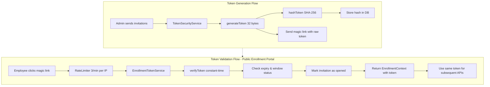

# Token Security Implementation Plan (BE-003)

> **Ticket**: BE-003 - Token Service & Security  
> **Story Points**: 5  
> **Duration**: 5 days  
> **Status**: Ready for Implementation  
> **Last Updated**: February 4, 2026

> **Global API rate limits (F-04):** See [docs/guides/rate-limiting-f04.md](../../guides/rate-limiting-f04.md) for `GlobalRateLimitFilter` tiers (AUTH / ENROLLMENT / DEFAULT). This plan covers enrollment-token-specific limits only.

---

## Overview

This document outlines the implementation plan for secure token generation, validation, and rate limiting for the enrollment invitation system. The implementation ensures cryptographically secure tokens, constant-time verification, and protection against brute-force attacks.

---

## Architecture Diagram



---

## Components to Implement

### 1. TokenSecurityService (Low-Level Cryptographic Operations)

**File**: `src/main/java/com/vimainsurance/vimaadmin/service/TokenSecurityService.java`

**Purpose**: Handles all cryptographic operations for token security.

**Methods**:

```java
@Service
public class TokenSecurityService {
    private static final Logger logger = LoggerFactory.getLogger(TokenSecurityService.class);
    private static final int TOKEN_BYTE_LENGTH = 32; // 256 bits
    private static final String HASH_ALGORITHM = "SHA-256";
    
    /**
     * Generates a cryptographically secure random token
     * @return 32-byte token encoded as URL-safe Base64 string
     */
    public String generateToken() {
        SecureRandom secureRandom = new SecureRandom();
        byte[] tokenBytes = new byte[TOKEN_BYTE_LENGTH];
        secureRandom.nextBytes(tokenBytes);
        
        // URL-safe Base64 encoding (no padding, no special chars)
        String token = Base64.getUrlEncoder().withoutPadding().encodeToString(tokenBytes);
        
        logger.debug("Generated token: {}...", token.substring(0, 8));
        return token;
    }
    
    /**
     * Hashes a raw token using SHA-256
     * @param rawToken The raw token to hash
     * @return Hex-encoded hash (64 characters)
     */
    public String hashToken(String rawToken) {
        try {
            MessageDigest digest = MessageDigest.getInstance(HASH_ALGORITHM);
            byte[] hashBytes = digest.digest(rawToken.getBytes(StandardCharsets.UTF_8));
            
            // Convert to hex string
            StringBuilder hexString = new StringBuilder();
            for (byte b : hashBytes) {
                String hex = Integer.toHexString(0xff & b);
                if (hex.length() == 1) hexString.append('0');
                hexString.append(hex);
            }
            
            return hexString.toString();
        } catch (NoSuchAlgorithmException e) {
            logger.error("SHA-256 algorithm not available", e);
            throw new RuntimeException("Failed to hash token", e);
        }
    }
    
    /**
     * Verifies a raw token against a stored hash using constant-time comparison
     * @param rawToken The raw token to verify
     * @param storedHash The stored hash to compare against
     * @return true if token matches, false otherwise
     */
    public boolean verifyToken(String rawToken, String storedHash) {
        String computedHash = hashToken(rawToken);
        
        // Use constant-time comparison to prevent timing attacks
        return MessageDigest.isEqual(
            computedHash.getBytes(StandardCharsets.UTF_8),
            storedHash.getBytes(StandardCharsets.UTF_8)
        );
    }
}
```

**Key Implementation Details**:
- Uses `SecureRandom` for cryptographically secure random generation
- Generates 32-byte (256-bit) tokens for strong entropy
- Uses URL-safe Base64 encoding (no special characters that need escaping in URLs)
- SHA-256 hashing is one-way (irreversible)
- Constant-time comparison prevents timing attacks
- Only logs first 8 characters of token for debugging

---

### 2. EnrollmentTokenService (Business Logic for Token Validation)

**File**: `src/main/java/com/vimainsurance/vimaadmin/service/IEnrollmentTokenService.java` (Interface)  
**File**: `src/main/java/com/vimainsurance/vimaadmin/service/serviceimpl/EnrollmentTokenServiceImpl.java` (Implementation)

**Purpose**: Validates enrollment tokens and manages invitation lifecycle.

**Interface**:

```java
public interface IEnrollmentTokenService {
    /**
     * Validates an enrollment token and returns context
     * 
     * @param rawToken Raw token from magic link URL
     * @param request HTTP request for IP extraction and rate limiting
     * @return Enrollment context with employee, window, and submission data
     * @throws InvalidTokenException if token is invalid
     * @throws TokenExpiredException if token has expired
     * @throws TokenAlreadyUsedException if invitation is already completed
     * @throws EnrollmentWindowClosedException if window is not active
     */
    EnrollmentContext validateToken(String rawToken, HttpServletRequest request);
}
```

**Implementation**:

```java
@Service
public class EnrollmentTokenServiceImpl implements IEnrollmentTokenService {
    private static final Logger logger = LoggerFactory.getLogger(EnrollmentTokenServiceImpl.class);
    
    @Autowired
    private TokenSecurityService tokenSecurityService;
    
    @Autowired
    private IEnrollmentInvitationRepository invitationRepository;
    
    @Autowired
    private IEnrollmentWindowsRepository windowRepository;
    
    @Autowired
    private IEnrollmentSubmissionRepository submissionRepository;
    
    @Override
    @Transactional
    @RateLimit(limit = 3, periodMinutes = 1)
    public EnrollmentContext validateToken(String rawToken, HttpServletRequest request) {
        logger.info("[correlationId:{}] Validating token: {}...", 
            MDC.get("correlationId"), 
            rawToken.substring(0, Math.min(8, rawToken.length()))
        );
        
        // Step 1: Hash the token
        String tokenHash = tokenSecurityService.hashToken(rawToken);
        
        // Step 2: Find invitation by hash
        EnrollmentInvitation invitation = invitationRepository.findByTokenHash(tokenHash)
            .orElseThrow(() -> new InvalidTokenException("Invalid or unknown token"));
        
        // Step 3: Check if token has expired
        if (invitation.getExpiresAt().isBefore(LocalDateTime.now())) {
            logger.warn("[correlationId:{}] Token expired for invitation: {}", 
                MDC.get("correlationId"), 
                invitation.getId()
            );
            throw new TokenExpiredException("Token has expired");
        }
        
        // Step 4: Check if invitation is already completed
        if (invitation.getStatus() == EnrollementStatus.COMPLETED) {
            throw new TokenAlreadyUsedException("Enrollment has already been completed");
        }
        
        // Step 5: Verify enrollment window is active
        EnrollmentWindows window = invitation.getEnrollmentWindow();
        if (window.getStatus() != EnrollementStatus.ACTIVE) {
            throw new EnrollmentWindowClosedException("Enrollment window is not active");
        }
        
        // Step 6: Mark invitation as opened (if first access)
        if (invitation.getStatus() == EnrollementStatus.SENT) {
            invitation.setStatus(EnrollementStatus.OPENED);
            invitation.setOpenedAt(LocalDateTime.now());
            invitationRepository.save(invitation);
            logger.info("[correlationId:{}] Invitation marked as opened: {}", 
                MDC.get("correlationId"), 
                invitation.getId()
            );
        }
        
        // Step 7: Get or create draft submission
        EnrollmentSubmission submission = submissionRepository
            .findByEmployee_IndividualIdAndEnrollmentWindow_Id(
                invitation.getEmployee().getIndividualId(),
                window.getId()
            )
            .orElseGet(() -> createDraftSubmission(invitation));
        
        // Step 8: Build and return context (with raw token for subsequent API calls)
        Deals employee = invitation.getEmployee();
        EnrollmentContext context = EnrollmentContext.builder()
            .rawToken(rawToken)  // Return token for subsequent API calls
            .invitationId(invitation.getId())
            .expiresAt(invitation.getExpiresAt())
            .daysRemaining(ChronoUnit.DAYS.between(LocalDateTime.now(), invitation.getExpiresAt()))
            .employeeId(employee.getIndividualId())
            .employeeName(employee.getFullName())
            .employeeEmail(employee.getEmail())
            .dateOfBirth(employee.getDateOfBirth())
            .grade(employee.getGrade())
            .windowId(window.getId())
            .windowName(window.getName())
            .windowStartDate(window.getStartDate())
            .windowEndDate(window.getEndDate())
            .windowStatus(window.getStatus())
            .windowConfig(window.getConfig())
            .submissionId(submission.getId())
            .submissionStatus(submission.getStatus())
            .planSelections(submission.getPlanSelections())
            .nomineeData(submission.getNomineeData())
            .build();
        
        logger.info("[correlationId:{}] Token validation successful for employee: {}", 
            MDC.get("correlationId"), 
            employee.getIndividualId()
        );
        
        return context;
    }
    
    private EnrollmentSubmission createDraftSubmission(EnrollmentInvitation invitation) {
        EnrollmentSubmission submission = new EnrollmentSubmission();
        submission.setEmployee(invitation.getEmployee());
        submission.setEnrollmentWindow(invitation.getEnrollmentWindow());
        submission.setInvitation(invitation);
        submission.setStatus(EnrollementStatus.DRAFT);
        submission.setPlanSelections("[]");
        submission.setNomineeData("{}");
        submission.setPremiumBreakdown("{}");
        return submissionRepository.save(submission);
    }
}
```

**Key Implementation Details**:
- Uses `@Transactional` to ensure atomicity
- Updates invitation status on first access (SENT → OPENED)
- Creates draft submission if not exists
- Returns raw token in context for subsequent API calls (no JWT needed)
- Validates expiry, usage, and window status
- Logs all operations with correlation ID
- Public enrollment portal - no admin authentication required

---

### 3. EnrollmentContext DTO

**File**: `src/main/java/com/vimainsurance/vimaadmin/dto/EnrollmentContext.java`

**Purpose**: Data transfer object returned after successful token validation.

```java
@Data
@Builder
public class EnrollmentContext {
    // Token info - raw token returned for subsequent API calls
    private String rawToken;
    private UUID invitationId;
    private LocalDateTime expiresAt;
    private Long daysRemaining;
    
    // Employee info
    private UUID employeeId;
    private String employeeName;
    private String employeeEmail;
    private LocalDate dateOfBirth;
    private String grade;
    
    // Window info
    private UUID windowId;
    private String windowName;
    private LocalDate windowStartDate;
    private LocalDate windowEndDate;
    private EnrollementStatus windowStatus;
    private String windowConfig; // JSONB config
    
    // Submission info (nullable if not started)
    private UUID submissionId;
    private EnrollementStatus submissionStatus;
    private String planSelections; // JSONB
    private String nomineeData; // JSONB
}
```

---

### 4. Custom Exceptions

**Location**: `src/main/java/com/vimainsurance/vimaadmin/exception/`

#### 4.1 InvalidTokenException

```java
@ResponseStatus(HttpStatus.BAD_REQUEST)
public class InvalidTokenException extends RuntimeException {
    public InvalidTokenException(String message) {
        super(message);
    }
    
    public InvalidTokenException(String message, Throwable cause) {
        super(message, cause);
    }
}
```

#### 4.2 TokenExpiredException

```java
@ResponseStatus(HttpStatus.GONE)
public class TokenExpiredException extends RuntimeException {
    public TokenExpiredException(String message) {
        super(message);
    }
    
    public TokenExpiredException(String message, Throwable cause) {
        super(message, cause);
    }
}
```

#### 4.3 TokenAlreadyUsedException

```java
@ResponseStatus(HttpStatus.CONFLICT)
public class TokenAlreadyUsedException extends RuntimeException {
    public TokenAlreadyUsedException(String message) {
        super(message);
    }
    
    public TokenAlreadyUsedException(String message, Throwable cause) {
        super(message, cause);
    }
}
```

#### 4.4 EnrollmentWindowClosedException

```java
@ResponseStatus(HttpStatus.FORBIDDEN)
public class EnrollmentWindowClosedException extends RuntimeException {
    public EnrollmentWindowClosedException(String message) {
        super(message);
    }
    
    public EnrollmentWindowClosedException(String message, Throwable cause) {
        super(message, cause);
    }
}
```

---

### 5. Rate Limiting with Bucket4j

#### 5.1 Add Dependency to pom.xml

```xml
<dependency>
    <groupId>com.bucket4j</groupId>
    <artifactId>bucket4j-core</artifactId>
    <version>8.7.0</version>
</dependency>
```

#### 5.2 @RateLimit Annotation

**File**: `src/main/java/com/vimainsurance/vimaadmin/annotation/RateLimit.java`

```java
@Target(ElementType.METHOD)
@Retention(RetentionPolicy.RUNTIME)
public @interface RateLimit {
    int limit() default 3;
    int periodMinutes() default 1;
}
```

#### 5.3 RateLimitAspect

**File**: `src/main/java/com/vimainsurance/vimaadmin/aspect/RateLimitAspect.java`

```java
@Aspect
@Component
public class RateLimitAspect {
    private static final Logger logger = LoggerFactory.getLogger(RateLimitAspect.class);
    
    private final ConcurrentHashMap<String, Bucket> cache = new ConcurrentHashMap<>();
    
    @Around("@annotation(rateLimit)")
    public Object enforceRateLimit(ProceedingJoinPoint joinPoint, RateLimit rateLimit) throws Throwable {
        // Get HTTP request from method arguments
        HttpServletRequest request = null;
        for (Object arg : joinPoint.getArgs()) {
            if (arg instanceof HttpServletRequest) {
                request = (HttpServletRequest) arg;
                break;
            }
        }
        
        if (request == null) {
            // If no request found, skip rate limiting
            return joinPoint.proceed();
        }
        
        // Extract IP address
        String ipAddress = IpAddressExtractor.extractIpAddress(request);
        
        // Get or create bucket for this IP
        Bucket bucket = cache.computeIfAbsent(ipAddress, k -> createBucket(rateLimit));
        
        // Try to consume a token
        ConsumptionProbe probe = bucket.tryConsumeAndReturnRemaining(1);
        
        if (probe.isConsumed()) {
            // Token consumed successfully, allow request
            logger.debug("[correlationId:{}] Rate limit check passed for IP: {}", 
                MDC.get("correlationId"), 
                ipAddress
            );
            return joinPoint.proceed();
        } else {
            // Rate limit exceeded
            long waitTime = probe.getNanosToWaitForRefill() / 1_000_000_000L; // Convert to seconds
            
            logger.warn("[correlationId:{}] Rate limit exceeded for IP: {}. Retry after {} seconds", 
                MDC.get("correlationId"), 
                ipAddress, 
                waitTime
            );
            
            throw new RateLimitExceededException("Too many requests. Retry after " + waitTime + " seconds");
        }
    }
    
    private Bucket createBucket(RateLimit rateLimit) {
        // Create bucket with specified rate limit
        Bandwidth limit = Bandwidth.classic(
            rateLimit.limit(), 
            Refill.intervally(rateLimit.limit(), Duration.ofMinutes(rateLimit.periodMinutes()))
        );
        
        return Bucket.builder()
            .addLimit(limit)
            .build();
    }
}
```

#### 5.4 RateLimitExceededException

**File**: `src/main/java/com/vimainsurance/vimaadmin/exception/RateLimitExceededException.java`

```java
@ResponseStatus(HttpStatus.TOO_MANY_REQUESTS)
public class RateLimitExceededException extends RuntimeException {
    public RateLimitExceededException(String message) {
        super(message);
    }
}
```

---

### 6. IP Address Extraction Utility

**File**: `src/main/java/com/vimainsurance/vimaadmin/util/IpAddressExtractor.java`

```java
public class IpAddressExtractor {
    
    /**
     * Extracts the client IP address from the HTTP request.
     * Handles X-Forwarded-For, X-Real-IP headers and direct connection.
     * 
     * @param request HTTP servlet request
     * @return Client IP address
     */
    public static String extractIpAddress(HttpServletRequest request) {
        // Check X-Forwarded-For header (used by proxies/load balancers)
        String ip = request.getHeader("X-Forwarded-For");
        
        if (ip == null || ip.isEmpty() || "unknown".equalsIgnoreCase(ip)) {
            // Check X-Real-IP header (alternative proxy header)
            ip = request.getHeader("X-Real-IP");
        }
        
        if (ip == null || ip.isEmpty() || "unknown".equalsIgnoreCase(ip)) {
            // Fall back to direct connection IP
            ip = request.getRemoteAddr();
        }
        
        // X-Forwarded-For can contain multiple IPs (client, proxy1, proxy2, ...)
        // Take the first IP (the original client)
        if (ip != null && ip.contains(",")) {
            ip = ip.split(",")[0].trim();
        }
        
        return ip;
    }
}
```

---

### 7. Configuration

#### 7.1 Application Properties

Add to `src/main/resources/application-uat.properties` and `application-prod.properties`:

```properties
# Enrollment Token Security
enrollment.token.expiry.days=7
enrollment.token.rate-limit.enabled=true
enrollment.token.rate-limit.max-requests=3
enrollment.token.rate-limit.period-minutes=1
```

#### 7.2 Enable AOP

Create or update configuration class:

**File**: `src/main/java/com/vimainsurance/vimaadmin/config/EnrollmentSecurityConfig.java`

```java
@Configuration
@EnableAspectJAutoProxy
public class EnrollmentSecurityConfig {
    // Aspects will be auto-detected and registered
}
```

---

## Using Token for Subsequent API Calls

Since this is a **public enrollment portal**, all subsequent API calls will use the same magic link token for authentication (no JWT needed).

### Frontend Flow

```javascript
// 1. Employee clicks magic link
const token = getTokenFromURL(); // e.g., from ?token=abc123xyz

// 2. Validate token and get context
const response = await fetch(`/api/v1/enrollment/${token}/validate`);
const context = await response.json();

// 3. Store token for subsequent calls
localStorage.setItem('enrollmentToken', context.rawToken);

// 4. Use token for all subsequent API calls
// Option A: Token in URL path
await fetch(`/api/v1/enrollment/${token}/dependents`, {
    method: 'POST',
    body: JSON.stringify(dependentData)
});

// Option B: Token in header (cleaner for POST/PUT)
await fetch(`/api/v1/enrollment/dependents`, {
    method: 'POST',
    headers: {
        'X-Enrollment-Token': token,
        'Content-Type': 'application/json'
    },
    body: JSON.stringify(dependentData)
});
```

### Backend Endpoints (Future Implementation)

All enrollment endpoints will validate the token on every request:

```java
// Option A: Token in path
@PostMapping("/enrollment/{token}/dependents")
public ResponseEntity<?> addDependent(
    @PathVariable String token,
    @RequestBody DependentRequestDto request
) {
    // Validate token on every request
    enrollmentTokenService.validateToken(token, httpRequest);
    // Process request...
}

// Option B: Token in header (recommended)
@PostMapping("/enrollment/dependents")
public ResponseEntity<?> addDependent(
    @RequestHeader("X-Enrollment-Token") String token,
    @RequestBody DependentRequestDto request
) {
    // Validate token on every request
    enrollmentTokenService.validateToken(token, httpRequest);
    // Process request...
}
```

### Why Token-Based vs JWT?

✅ **Simpler**: No session management, no role conflicts  
✅ **More Secure**: Token expires automatically, can't be reused after completion  
✅ **Stateless**: Each request validates independently  
✅ **Public Portal**: No integration with admin authentication system  
✅ **Single-Use**: Invitation status prevents token reuse after enrollment completes

---

## Implementation Order

Follow this sequence for a smooth implementation:

### Day 1: Core Security (2-3 hours)
1. Create `TokenSecurityService`
   - Implement `generateToken()`
   - Implement `hashToken()`
   - Implement `verifyToken()`
2. Manual testing with simple main method

### Day 2: Exceptions & DTO (1-2 hours)
1. Create all 4 custom exception classes
2. Create `EnrollmentContext` DTO
3. Create `IpAddressExtractor` utility

### Day 3: Token Validation Service (3-4 hours)
1. Create `IEnrollmentTokenService` interface
2. Create `EnrollmentTokenServiceImpl`
   - Implement full validation logic
   - Integrate with repositories
   - Return token in context (no JWT generation)
3. Manual testing with Postman

### Day 4: Rate Limiting (2-3 hours)
1. Add Bucket4j dependency to `pom.xml`
2. Create `@RateLimit` annotation
3. Create `RateLimitAspect`
4. Create `RateLimitExceededException`
5. Enable AOP in configuration
6. Test rate limiting with multiple requests

### Day 5: Integration & Documentation (2-3 hours)
1. End-to-end testing with all components
2. Add Javadoc to all public methods
3. Update Swagger annotations (if needed)
4. Code review and refinements
5. Update this document with any changes

---

## File Structure Summary

```
src/main/java/com/vimainsurance/vimaadmin/
├── annotation/
│   └── RateLimit.java ✨ NEW
├── aspect/
│   └── RateLimitAspect.java ✨ NEW
├── dto/
│   └── EnrollmentContext.java ✨ NEW
├── exception/
│   ├── InvalidTokenException.java ✨ NEW
│   ├── TokenExpiredException.java ✨ NEW
│   ├── TokenAlreadyUsedException.java ✨ NEW
│   ├── EnrollmentWindowClosedException.java ✨ NEW
│   └── RateLimitExceededException.java ✨ NEW
├── service/
│   ├── TokenSecurityService.java ✨ NEW
│   ├── IEnrollmentTokenService.java ✨ NEW
│   └── serviceimpl/
│       └── EnrollmentTokenServiceImpl.java ✨ NEW
├── util/
│   └── IpAddressExtractor.java ✨ NEW
└── config/
    └── EnrollmentSecurityConfig.java ✨ NEW

src/main/resources/
├── application-uat.properties ✏️ MODIFIED
└── application-prod.properties ✏️ MODIFIED

pom.xml ✏️ MODIFIED (add Bucket4j dependency)
```

**Total**: 11 new files, 3 modified files

---

## Acceptance Criteria

All requirements from BE-003 ticket:

✅ **Tokens are 256-bit URL-safe strings**
- `TokenSecurityService.generateToken()` generates 32-byte (256-bit) tokens
- Base64 URL-safe encoding without special characters

✅ **Raw tokens never stored or logged**
- Only SHA-256 hashes stored in database
- Logs show only first 8 characters for debugging

✅ **Rate limiting returns 429 Too Many Requests**
- `RateLimitAspect` enforces 3 requests/minute per IP
- Returns `429 TOO_MANY_REQUESTS` status
- Includes retry-after information in error message

✅ **All error scenarios handled**
- Invalid token → `400 BAD_REQUEST`
- Expired token → `410 GONE`
- Already used → `409 CONFLICT`
- Window closed → `403 FORBIDDEN`
- Rate limit → `429 TOO_MANY_REQUESTS`

✅ **Token-based authentication (no JWT)**
- Raw token returned in `EnrollmentContext`
- Token used for all subsequent API calls
- No integration with admin authentication system
- Public enrollment portal

---

## Security Considerations

### Token Security
- ✅ 256-bit entropy prevents brute force attacks
- ✅ SHA-256 hashing is one-way (irreversible)
- ✅ Constant-time comparison prevents timing attacks
- ✅ URL-safe encoding prevents injection issues
- ✅ Tokens expire after 7 days (configurable)

### Rate Limiting
- ✅ Prevents brute force token validation attempts
- ✅ 3 requests per minute per IP address
- ✅ Independent buckets per IP (no global state)
- ✅ Automatic token refill over time

### Database
- ✅ Only hashed tokens stored in `token_hash` column
- ✅ Unique constraint prevents hash collisions
- ✅ Indexed for fast lookups

---

## Testing Strategy (Manual)

### 1. Token Generation & Hashing
```bash
# Test token generation
curl -X POST http://localhost:8080/api/v1/test/generate-token

# Verify token format (should be URL-safe Base64, ~43 chars)
# Verify hash is 64-character hex string
```

### 2. Token Validation
```bash
# Valid token
curl -X GET http://localhost:8080/api/v1/enrollment/{token}/validate

# Expected: 200 OK with EnrollmentContext including rawToken field

# Invalid token
curl -X GET http://localhost:8080/api/v1/enrollment/invalid-token/validate

# Expected: 400 BAD_REQUEST

# Expired token (manually set expires_at in past)
curl -X GET http://localhost:8080/api/v1/enrollment/{expired-token}/validate

# Expected: 410 GONE

# Verify rawToken is returned in response
# Frontend will use this token for all subsequent API calls
```

### 3. Rate Limiting
```bash
# Make 4 requests within 1 minute from same IP
curl -X GET http://localhost:8080/api/v1/enrollment/{token}/validate
curl -X GET http://localhost:8080/api/v1/enrollment/{token}/validate
curl -X GET http://localhost:8080/api/v1/enrollment/{token}/validate
curl -X GET http://localhost:8080/api/v1/enrollment/{token}/validate

# Expected: First 3 requests succeed, 4th returns 429 TOO_MANY_REQUESTS
```

### 4. Status Updates
```bash
# First access - check invitation status changes to OPENED
# Verify opened_at timestamp is set
# Subsequent access - status remains OPENED
```

---

## Troubleshooting

### Common Issues

**Issue**: Rate limiting not working
- **Solution**: Verify `@EnableAspectJAutoProxy` is present in config
- **Solution**: Check AspectJ dependency in pom.xml

**Issue**: Tokens don't match hash
- **Solution**: Ensure consistent encoding (UTF-8) in hash and verification
- **Solution**: Verify SHA-256 algorithm is available

**Issue**: IP extraction returns null
- **Solution**: Check proxy/load balancer configuration
- **Solution**: Verify X-Forwarded-For header is set correctly

---

## Next Steps

After completing this implementation:

1. **BE-004**: Enrollment Window Management APIs
2. **BE-005**: Invitation & Email Service APIs
3. **BE-006**: Employee Enrollment - Token Validation API (public endpoint)

---

**Questions or Issues?** 
Contact the development team or refer to the [Tech Stack Documentation](./tech-stack-and-code-patterns.md).
