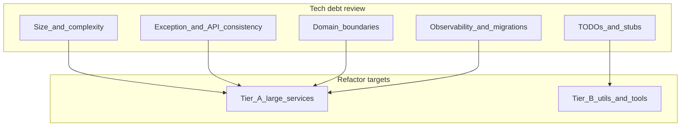

# Vima-backend: tech debt and quality plan

**Purpose:** Single repo document combining the **engineering tech-debt plan** (refactor targets, split map, verification) with the **baseline static analysis** snapshot (SpotBugs, Maven dependency analyze) and links to committed artifacts.

**Artifacts (HTML + logs):** [reports/README.md](reports/README.md) — includes [spotbugs-report.html](reports/spotbugs-report.html) and [dependency-analyze.log](reports/dependency-analyze.log). A shorter duplicate narrative lives in [reports/static-analysis-bundle.md](reports/static-analysis-bundle.md).

**Related:** [static-analysis-report.md](static-analysis-report.md) (Markdown-only narrative). The Cursor plan YAML this was merged from is not stored in git; this file is the canonical in-repo copy.

---

## Action checklist

Track progress in issues or PRs; check boxes when done.

- [ ] **P0 — Supply chain:** dependency tree review + CVE scanning (OWASP Dependency-Check, Dependabot/Renovate, or Snyk) with suppression policy and SLA
- [ ] **P1 — Continuous quality:** SonarQube quality gate or SonarLint / Semgrep on Java/Spring
- [ ] **P2 — Compile-time bug finders:** SpotBugs + optional FindSecBugs in CI; Error Prone phased in after P0 stabilizes
- [ ] **P3 — Optional:** NullAway; ArchUnit package rules after service slices exist
- [ ] **Quick wins:** triage TODO/FIXME, `@Deprecated` config, `printStackTrace`, stubs (`DigitServiceImpl`, `MaskServiceImpl`, `TesseractTest`)
- [ ] **Structural splits:** one vertical slice per PR using the [Code split map](#code-split-map-concrete-slices-to-verify); keep `IOrganizationService` / `IEnrollmentWindowService` contracts stable until callers migrate
- [ ] **Verify each split:** `mvn test`, facade line-count drop, smoke critical REST paths, transaction boundaries
- [ ] **Error handling:** reduce broad `catch (Exception)` via `@ControllerAdvice` or shared helpers

---

## Baseline static analysis (2026-05-13)

One local run informed this plan. **SpotBugs:** 963 findings (plugin `4.8.6.4`). **Top types:** `EI_EXPOSE_REP2` (515), `EI_EXPOSE_REP` (277), `NP_NULL_ON_SOME_PATH_FROM_RETURN_VALUE` (55), `REC_CATCH_EXCEPTION` (19). **Top classes:** `VendorMasterDataConfig$VendorMasterData`, `Claim`, `Endorsement`, `DocumentServiceImpl`, `CustomerServiceImpl`, `PolicyServiceImpl`, etc.

**Pretty report:** open [reports/spotbugs-report.html](reports/spotbugs-report.html) in a browser.

**Maven `dependency:analyze`:** full log in [reports/dependency-analyze.log](reports/dependency-analyze.log). Treat “unused declared” **Spring Boot starters** as false positives. Review direct deps: legacy `httpclient` 4.5.x, `javax.servlet-api` alongside Jakarta, `org.json`, `jjwt`, Keycloak admin client.

**Regenerate artifacts:** see [reports/static-analysis-bundle.md](reports/static-analysis-bundle.md) (section *How to reproduce and refresh this bundle*).

---

## Engineering backlog

## What to consider (review dimensions)

- **Architecture and boundaries**: Are controllers thin and services cohesive? Watch for “god” services that mix enrollment, HR, billing, and persistence in one class. Prefer vertical slices or domain packages with clear ports (e.g. claims vs enrollment vs retail).
- **Spring idioms**: Prefer constructor injection and smaller `@Service` beans over many `@Autowired` fields on one class (high field injection count often correlates with large classes).
- **Error handling and API contracts**: Replace broad `catch (Exception e)` with typed exceptions, domain errors, and consistent HTTP/problem-details mapping where appropriate. Ensure failures are observable (structured logs, correlation IDs — you already have [`CorrelationIdFilter.java`](../src/main/java/com/vimainsurance/vimaadmin/util/CorrelationIdFilter.java)).
- **Transactions and consistency**: Long methods with multiple repository calls may need explicit `@Transactional` boundaries, read-only queries, and idempotency for webhooks/imports.
- **Data access**: N+1 queries, `@EntityGraph` / fetch joins, pagination caps (several services already warn about in-memory sorting for large sets — keep that pattern explicit).
- **Security**: Centralize authz (`@PreAuthorize`), avoid role string drift between JWT and DB, audit sensitive paths (you have audit infrastructure under [`audit/`](../src/main/java/com/vimainsurance/vimaadmin/audit/)).
- **Testability**: Large classes are hard to unit test; extract pure functions (calculations, mapping) and integration-test critical flows only.
- **Dead code and tooling**: `util/` mixes production helpers with CLI-style mains and OCR experiments — exclude or relocate so production classpath stays lean.
- **Observability and ops**: Metrics on slow paths, migration safety, feature flags alignment with [`FeatureFlagServiceImpl.java`](../src/main/java/com/vimainsurance/vimaadmin/service/serviceimpl/FeatureFlagServiceImpl.java).

## Java files with the strongest refactor signals (from this codebase)

### Tier A — very large `*ServiceImpl` / service-layer classes (split by use case first)

These are the largest under [`service/serviceimpl/`](../src/main/java/com/vimainsurance/vimaadmin/service/serviceimpl/) (line counts are approximate from `wc -l`):

- **[`OrganizationServiceImpl.java`](../src/main/java/com/vimainsurance/vimaadmin/service/serviceimpl/OrganizationServiceImpl.java)** (~2271 lines) — primary candidate for decomposition (org CRUD vs documents vs policies vs demo-related paths if mixed).
- **[`EnrollmentWindowServiceImpl.java`](../src/main/java/com/vimainsurance/vimaadmin/service/serviceimpl/EnrollmentWindowServiceImpl.java)** (~2047 lines) — also contains multiple `@SuppressWarnings("unchecked")` (map/collection handling); good place to introduce typed DTOs or small mappers.
- **[`EmployeeService.java`](../src/main/java/com/vimainsurance/vimaadmin/service/serviceimpl/EmployeeService.java)** (~2031 lines) — **naming/location debt**: a `@Service` named `EmployeeService` living under `serviceimpl` without `Impl` suffix; refactor toward `EmployeeServiceImpl` + `IEmployeeService` consistency, or move to a clearer package.
- **[`HRApprovalServiceImpl.java`](../src/main/java/com/vimainsurance/vimaadmin/service/serviceimpl/HRApprovalServiceImpl.java)** (~1891 lines)
- **[`EndorsementServiceImpl.java`](../src/main/java/com/vimainsurance/vimaadmin/service/serviceimpl/EndorsementServiceImpl.java)** (~1886 lines)
- **[`PolicyServiceImpl.java`](../src/main/java/com/vimainsurance/vimaadmin/service/serviceimpl/PolicyServiceImpl.java)** (~1775 lines)
- **[`DemoSetupServiceImpl.java`](../src/main/java/com/vimainsurance/vimaadmin/service/serviceimpl/DemoSetupServiceImpl.java)** (~1228 lines) — often a grab-bag of seed flows; isolate per-domain setup collaborators.
- **[`DealsServiceImpl.java`](../src/main/java/com/vimainsurance/vimaadmin/service/serviceimpl/DealsServiceImpl.java)** (~1130 lines)
- **[`FeatureFlagServiceImpl.java`](../src/main/java/com/vimainsurance/vimaadmin/service/serviceimpl/FeatureFlagServiceImpl.java)** (~995 lines)
- **[`CustomerServiceImpl.java`](../src/main/java/com/vimainsurance/vimaadmin/service/serviceimpl/CustomerServiceImpl.java)** (~950 lines) — customer + documents + deals paths; natural split into customer vs document vs deal orchestration if coupling is high.

**Refactor approach for Tier A**: extract package-private collaborators (`OrganizationDocumentsService`, `EnrollmentWindowLifecycleService`, etc.), move mapping to dedicated mappers, and shrink public service surface to orchestration only.

## Code split map (concrete slices to verify)

Use **one PR per collaborator** (or per two tiny collaborators). The facade (`*ServiceImpl`) should become thin: validate input, call collaborator, map `ResponseDto`. **Verify** each row with the checklist in the next section.

### OrganizationServiceImpl — suggested collaborators

- **`OrganizationCrudService`** (or keep minimal CRUD in facade): `create`, `update`, `delete`, `getById`, `getAll`, `getAllActive`, `getAllWithFilters` — org aggregate + list/filter only.
- **`OrganizationDocumentFacade`**: `uploadDocument`, `downloadDocument`, `deleteDocument`, `getDocuments` — may delegate to existing [`DocumentServiceImpl`](../src/main/java/com/vimainsurance/vimaadmin/service/serviceimpl/DocumentServiceImpl.java) if logic overlaps.
- **`OrganizationLogoService`**: `uploadLogo` — isolated; today there is a TODO for real logo handling.
- **`OrganizationEmployeeQueryService`**: `getEmployees`, `getEmployee`, `getEmployeeDependents`, `getEmployeesByEndorsementId` — read paths; shared pagination/DTO mapping.
- **`OrganizationEmployeeMutationService`**: `deleteEmployee`, `bulkDeleteEmployees`, `manualDeleteEmployees`, `uploadEmployees`, `manualAddEmployees`, `validateEmployees`, `delete` (bulk list overload) — write-heavy; highest regression risk; add or extend tests before moving.
- **`OrganizationCsvDealsService`**: `validateCsv`, `uploadDealsFromCsv`, `deleteEmployeesFromCsv` — CSV + deals; keep separate from CRUD.
- **`OrganizationBroadcastEmailService`**: `sendOrganizationBroadcastEmail` — large block starting ~line 564; own bean for mail/template dependencies.

**Lower-risk order**: (1) documents facade, (2) leave or lightly extract CRUD, (3) employee reads, (4) CSV deals, (5) employee mutations, (6) broadcast email.

### EnrollmentWindowServiceImpl — suggested collaborators

- **`EnrollmentWindowLifecycleService`**: `create`, `getById`, `getAllWithFilters`, `update`, `activate`, `close`, `delete`, `getStats` — state-like transitions; keep `@Transactional` explicit on writes.
- **`EnrollmentWindowUploadService`**: `validateEmployees`, `validateUploadFile`, `uploadEmployees` — file and DTO parsing; introduce typed structures to remove `@SuppressWarnings("unchecked")` over time.
- **`EnrollmentWindowExportService`**: `exportEmployeesCsv` — streaming CSV; isolate for tests.

### CustomerServiceImpl — optional collaborators

- **`CustomerQueryService`**: `getAllCustomers`, `getByCustId` and access checks.
- **`CustomerDocumentOrchestrator`**: `uploadDocument`, `getDocuments`, `downloadDocument`, `deleteDocument`.
- **`CustomerDealConversionService`**: `customerToDeals` — own transaction boundary.

### Tier B util — CsvDealsReaderUtil

- **`CsvDealsParseResult`** (record) + parser class: raw rows to typed intermediate — unit tests on fixed sample CSVs.
- **`CsvDealsValidator`**: business rules and row-level errors — same golden files as today.
- **`CsvDealsImportOrchestrator`**: persistence in one transaction — integration or existing import test.

## Verification checklist (after each split)

- **Compile + unit tests**: run `mvn -q test` in `Vima-backend` (full suite on main; on a branch, at least tests for the touched module).
- **Behavior parity**: unchanged REST paths and response shapes unless you intentionally version; same HTTP status codes and `ResponseDto` fields for endpoints owned by the slice.
- **Size gate**: facade should shrink by a clear amount each PR (for example 200+ lines); aim for new collaborators under roughly 400 lines each when practical.
- **Transactions**: `@Transactional` on the method that persists; re-smoke one end-to-end flow that used to work (employee upload, window activate, CSV import).
- **Data access**: if the slice touched queries, watch for N+1 or changed fetch graphs (quick log or explain on one representative call).
- **Optional**: add an **ArchUnit** rule once two slices exist (for example: organization package must not depend on enrollment package).

### Tier B — large utilities / mixed “prod vs tool” code

- **[`CsvDealsReaderUtil.java`](../src/main/java/com/vimainsurance/vimaadmin/util/CsvDealsReaderUtil.java)** (~1151 lines) — parsing/validation-heavy; candidate for smaller classes per stage (parse, validate, persist).
- **[`KeyCloakUtil.java`](../src/main/java/com/vimainsurance/vimaadmin/util/KeyCloakUtil.java)** (~1242 lines) — central auth utility; refactor for test doubles and narrower public API.
- **[`EnrollmentUploadParserUtil.java`](../src/main/java/com/vimainsurance/vimaadmin/util/EnrollmentUploadParserUtil.java)** (~517 lines)
- **[`MaskServiceImpl.java`](../src/main/java/com/vimainsurance/vimaadmin/util/MaskServiceImpl.java)** (~482 lines) — contains **TODO auto-generated stub** comments (unfinished implementation debt).
- **[`TesseractTest.java`](../src/main/java/com/vimainsurance/vimaadmin/util/TesseractTest.java)** (~588 lines) — **uses `printStackTrace()`**; treat as non-production or move to `src/test` / a standalone module.

### Tier C — explicit TODO / stub / deprecated markers (quick wins list)

- **[`OrganizationServiceImpl.java`](../src/main/java/com/vimainsurance/vimaadmin/service/serviceimpl/OrganizationServiceImpl.java)** — TODO for logo upload.
- **[`HRServiceImpl.java`](../src/main/java/com/vimainsurance/vimaadmin/service/serviceimpl/HRServiceImpl.java)** — TODOs around claims activity / repository-backed claims data.
- **[`LifeEventEndorsementServiceImpl.java`](../src/main/java/com/vimainsurance/vimaadmin/service/serviceimpl/LifeEventEndorsementServiceImpl.java)** — TODO for loading affected employees and premium calculation wiring.
- **[`DigitServiceImpl.java`](../src/main/java/com/vimainsurance/vimaadmin/service/serviceimpl/DigitServiceImpl.java)** — TODO auto-generated stubs.
- **[`NotificationsProperties.java`](../src/main/java/com/vimainsurance/vimaadmin/notification/config/NotificationsProperties.java)** — `@Deprecated` field (config drift / migration path).

### Tier D — broad exception handling (many `catch (Exception` per file)

High counts in `*ServiceImpl.java` often indicate duplicated try/catch templates worth replacing with `@ControllerAdvice`, a small `ServiceResult`/`Either` style wrapper, or AOP for auditing only. Notable from grep counts: **[`PolicyServiceImpl`](../src/main/java/com/vimainsurance/vimaadmin/service/serviceimpl/PolicyServiceImpl.java)**, **[`OrganizationServiceImpl`](../src/main/java/com/vimainsurance/vimaadmin/service/serviceimpl/OrganizationServiceImpl.java)**, **[`EndorsementServiceImpl`](../src/main/java/com/vimainsurance/vimaadmin/service/serviceimpl/EndorsementServiceImpl.java)**, **[`AdminUserServiceImpl`](../src/main/java/com/vimainsurance/vimaadmin/service/serviceimpl/AdminUserServiceImpl.java)**, **[`EnrollmentWindowServiceImpl`](../src/main/java/com/vimainsurance/vimaadmin/service/serviceimpl/EnrollmentWindowServiceImpl.java)**, **[`HRApprovalServiceImpl`](../src/main/java/com/vimainsurance/vimaadmin/service/serviceimpl/HRApprovalServiceImpl.java)**.

### Controllers

Controllers in [`controller/`](../src/main/java/com/vimainsurance/vimaadmin/controller/) are generally smaller than services; the main debt is **delegating too much to oversized services**. [`OrganizationController.java`](../src/main/java/com/vimainsurance/vimaadmin/controller/OrganizationController.java) (~489 lines) and [`AdminClaimsController.java`](../src/main/java/com/vimainsurance/vimaadmin/controller/AdminClaimsController.java) (~345 lines) are relatively heavier — review for repeated patterns and split sub-resources if needed.

## Static analysis and dependency/CVE scan (priorities)

Goal: catch **known vulnerable dependencies** first, then **security/maintainability hotspots** in code, then **bug-pattern** checks in CI. “Add” means wire into CI or document runbooks; “run” is optional locally or on the pipeline (no refactor required to adopt reporting).

### Priority 0 — supply chain and runtime exposure (do first)

- **Dependency tree and direct vs transitive risk**: `mvn -f Vima-backend/pom.xml dependency:tree` (or project root if multi-module). Focus upgrades on **compile/runtime** scopes touching the web tier.
- **CVE scanning (pick one primary, keep a secondary)**:
  - **OWASP Dependency-Check** Maven plugin (`org.owasp:dependency-check-maven`) in CI with HTML/JSON report artifact and fail threshold aligned to policy.
  - **GitHub Dependabot** or **Renovate** on the repo for PR-driven upgrades (complements batch scans).
  - **Snyk** (or equivalent) if org standard — same role as above.
- **Policy**: document how to handle false positives (suppression file with **expiry** and owner), and SLA for critical CVEs.

### Priority 1 — continuous code quality and security smells

- **SonarQube** (server + quality gate on main/PR) **or**, for lighter adoption, **SonarLint** in IDE + periodic full scan export. Prioritize rules touching: SQL injection paths, authz gaps, secret patterns, complexity on the largest `*ServiceImpl` classes.
- If Sonar is not available: **Semgrep** with a Java/Spring rules pack as a lighter P1 alternative.

### Priority 2 — compile-time bug finders (CI-friendly)

- **SpotBugs** with **FindSecBugs** plugin: good for null derefs, bad crypto patterns, suspicious randomness, etc. Run `spotbugs:check` (or aggregate `verify`) in CI with an allowlist period for legacy findings.
- **Error Prone** as a `javac` plugin (or build-helper): catches real bug patterns (e.g. `equals`/`hashCode`, bad `Optional` use). Roll out incrementally with `-Xep:CheckName:OFF` for noisy checks until fixed.

### Priority 3 — optional depth

- **NullAway** (with a small annotated core) if you want stricter nullness after P0–P2 are stable.
- **ArchUnit** (see verification section) for package dependency rules once slices exist.

### Ordering note (execution order)

Run **P0 before** spending time on SpotBugs/Error Prone noise: upgrading a vulnerable library often changes bytecode patterns and report baselines.

## Suggested execution order

1. **Inventory (P0–P2)**: Complete the [Static analysis and dependency/CVE scan](#static-analysis-and-dependencycve-scan-priorities) section — dependency/CVE first, then Sonar (or SonarLint/Semgrep), then SpotBugs + Error Prone in CI when ready.
2. **Quick wins**: TODOs, deprecated config, `printStackTrace`, obvious stubs in `DigitServiceImpl` / `MaskServiceImpl`.
3. **Structural**: Split Tier A services behind stable interfaces so PRs stay small.
4. **Hardening**: Narrow exception handling and add regression tests around extracted modules.

