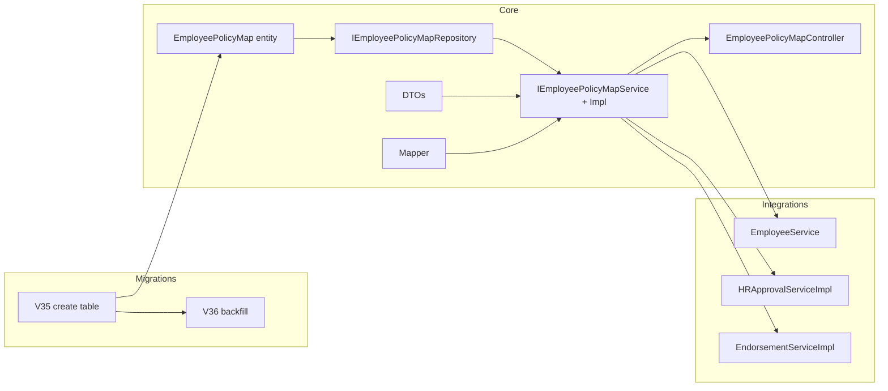

# BE-00: Employee–Policy Mapping Foundation — Implementation Plan

## Scope

Implement the many-to-many relationship between individuals (employees + dependents) and policies per [emp-policy-map-plan.md](Vima-backend/src/main/java/com/vimainsurance/vimaadmin/docs/group-insurance/emp-policy-map/emp-policy-map-plan.md). No frontend changes; backend only.

---

## 1. Database layer

### 1.1 Create table migration

**File:** `Vima-backend/src/main/resources/db/migration/V35__create_employee_policy_map.sql`

- Create `cpc.employee_policy_map` with columns and FKs as in plan Section 2.1:
  - FKs: `individual_id` → `cpc.customers(individual_id)`, `primary_employee_id` → `cpc.customers(individual_id)`, `policy_id` → `cpc.policies(policy_id)`, `organization_id` → `cpc.organizations(organization_id)`, `enrollment_window_id` → `cpc.enrollment_windows(id)`, `endorsement_id` → `cpc.endorsements(endorsement_id)`, `enrollment_submission_id` → `cpc.enrollment_submissions(id)`.
- Partial unique index: `(individual_id, policy_id) WHERE status = 'ACTIVE'`.
- Indexes: `individual_id`, `policy_id`, `organization_id`, `primary_employee_id` (partial WHERE NOT NULL), `status`, `enrollment_window_id` (partial), `endorsement_id` (partial).

### 1.2 Backfill migration

**File:** `Vima-backend/src/main/resources/db/migration/V36__backfill_employee_policy_map.sql`

- Backfill employees: `INSERT INTO cpc.employee_policy_map (...) SELECT ... FROM cpc.customers c JOIN cpc.policies p ON p.organization_id = c.organization_id WHERE c.relationship = 'SELF' AND c.status != 'INACTIVE' AND p.applies_to_employees = TRUE AND p.status = 'ACTIVE'`.
- Use `GREATEST(p.start_date, COALESCE(c.date_of_joining, c.created_at::date))` for `effective_from`. Use `'BACKFILL'` for `source`.
- Because the unique constraint is a **partial** index (`WHERE status = 'ACTIVE'`), PostgreSQL does not support `ON CONFLICT (individual_id, policy_id) DO NOTHING`. Use `WHERE NOT EXISTS (SELECT 1 FROM cpc.employee_policy_map epm2 WHERE epm2.individual_id = c.individual_id AND epm2.policy_id = p.policy_id AND epm2.status = 'ACTIVE')` in the SELECT so duplicates are not inserted.
- Backfill dependents: same pattern, joining `cpc.customers d` to `cpc.employee_policy_map epm` on `epm.individual_id = d.primary_individual_id AND epm.status = 'ACTIVE'`, and `WHERE d.primary_individual_id IS NOT NULL AND d.status != 'INACTIVE'`, again with `NOT EXISTS` to avoid duplicate (individual_id, policy_id) for ACTIVE.

---

## 2. Entity and repository

### 2.1 Entity

**File:** `Vima-backend/src/main/java/com/vimainsurance/vimaadmin/entity/EmployeePolicyMap.java`

- JPA entity, table `employee_policy_map`, schema `cpc`. Use `@Column` for all fields (no `@ManyToOne` to avoid lazy-load issues; keep FKs as UUID/Long). Types: `UUID id`, `UUID individualId`, `UUID primaryEmployeeId`, `String relationship`, `Long policyId`, `UUID organizationId`, `BigDecimal sumInsured`, `String coverageTier`, `Boolean isVoluntary`, `String status`, `LocalDate effectiveFrom`, `LocalDate effectiveTo`, `String cancellationReason`, `LocalDateTime cancelledAt`, `String source`, `UUID enrollmentWindowId`, `UUID endorsementId`, `UUID enrollmentSubmissionId`, `LocalDateTime createdAt`, `LocalDateTime updatedAt`. Add `@CreationTimestamp` / `@UpdateTimestamp` for timestamps. Lombok: `@Getter`, `@Setter`, `@NoArgsConstructor`, `@AllArgsConstructor`, `@Builder`.

### 2.2 Repository

**File:** `Vima-backend/src/main/java/com/vimainsurance/vimaadmin/repository/IEmployeePolicyMapRepository.java`

- Extend `JpaRepository<EmployeePolicyMap, UUID>` and `JpaSpecificationExecutor<EmployeePolicyMap>`.
- Methods: `findByIndividualIdAndStatus`, `findByPolicyIdAndStatus`, `findByPrimaryEmployeeIdAndStatus`, `findByIndividualIdAndRelationshipAndStatus`, `findByOrganizationIdAndStatus(..., Pageable)`, `existsByIndividualIdAndPolicyIdAndStatus`, `findByEnrollmentWindowIdAndStatus`, `findByEndorsementIdAndStatus`.
- `@Modifying` `@Query` for bulk cancel: `UPDATE EmployeePolicyMap m SET m.status = 'CANCELLED', m.effectiveTo = :effectiveDate, m.cancellationReason = :reason, m.cancelledAt = CURRENT_TIMESTAMP, m.updatedAt = CURRENT_TIMESTAMP WHERE (m.individualId = :employeeId OR m.primaryEmployeeId = :employeeId) AND m.status = 'ACTIVE'`. Use fully qualified entity name in `@Query` if the entity is in a different package (e.g. `com.vimainsurance.vimaadmin.entity.EmployeePolicyMap`).

---

## 3. DTOs and mapper

### 3.1 DTOs

- **Request:** [Vima-backend/src/main/java/com/vimainsurance/vimaadmin/dto/EmployeePolicyMapRequestDto.java](Vima-backend/src/main/java/com/vimainsurance/vimaadmin/dto/EmployeePolicyMapRequestDto.java) — fields per plan; `@NotNull`/`@NotBlank` where specified.
- **Response:** [Vima-backend/src/main/java/com/vimainsurance/vimaadmin/dto/EmployeePolicyMapResponseDto.java](Vima-backend/src/main/java/com/vimainsurance/vimaadmin/dto/EmployeePolicyMapResponseDto.java) — include joined display fields: `individualName`, `primaryEmployeeName`, `policyNumber`, `productType`, `insurerName` (all String; productType from Policy enum).
- **Bulk request:** [Vima-backend/src/main/java/com/vimainsurance/vimaadmin/dto/BulkEmployeePolicyMapRequestDto.java](Vima-backend/src/main/java/com/vimainsurance/vimaadmin/dto/BulkEmployeePolicyMapRequestDto.java) with inner `IndividualMappingDto` (individualId, primaryEmployeeId, relationship, sumInsured, coverageTier).

### 3.2 Mapper

**File:** `Vima-backend/src/main/java/com/vimainsurance/vimaadmin/mapper/EmployeePolicyMapMapper.java`

- Static helpers: entity → response DTO (with parameters for joined names: individualName, primaryEmployeeName, policyNumber, productType, insurerName). Request DTO → entity (for create). No need for a separate Mapper class if the service builds response DTOs by loading related entities (Deals, Policy, InsuranceProvider) and setting names; otherwise centralize in mapper.

---

## 4. Service layer

### 4.1 Interface

**File:** `Vima-backend/src/main/java/com/vimainsurance/vimaadmin/service/IEmployeePolicyMapService.java`

- CRUD: `createMapping`, `createBulkMappings`, `cancelMapping`, `cancelAllForEmployee` (return `ResponseEntity<ResponseDto<...>>` for controller use).
- Queries: `getMappingsForIndividual`, `getMappingsForPolicy`, `getMappingsForEmployeeFamily`, `getMappingsForOrganization` (paginated).
- Validation: `boolean isIndividualCoveredByPolicy(UUID individualId, Long policyId)`.
- Lifecycle (void, called by other services): `createMappingsFromBulkUpload(UUID organizationId, List<UUID> employeeIds, String source)`, `createMappingsFromEnrollmentSubmission(UUID submissionId)`, `createMappingsFromEndorsement(UUID endorsementId, String endorsementType)`, `cancelMappingsFromEndorsement(UUID endorsementId)`.

### 4.2 Implementation

**File:** `Vima-backend/src/main/java/com/vimainsurance/vimaadmin/service/serviceimpl/EmployeePolicyMapServiceImpl.java`

- Inject: `IEmployeePolicyMapRepository`, `IDealsRepository`, `IPolicyRepository`, `IEnrollmentSubmissionRepository`, `IInsuranceProviderRepository` (for insurer name in response). Use existing [IPolicyRepository](Vima-backend/src/main/java/com/vimainsurance/vimaadmin/repository/IPolicyRepository.java) `findByOrganizationIdAndStatus(orgId, PolicyStatus.ACTIVE)` and filter by `appliesToEmployees == true` in code (or add a repository method if preferred).
- **createMapping:** Validate FKs exist, check no duplicate ACTIVE (individual_id, policy_id), then save. Build response DTO with names from Deals, Policy, InsuranceProvider.
- **createBulkMappings:** Loop `BulkEmployeePolicyMapRequestDto.getIndividuals()`, create entity per row, save in batch (e.g. `saveAll` in chunks of 500). Use same source for all.
- **cancelMapping:** Load by id; if ACTIVE, set status = CANCELLED, effectiveTo, cancellationReason, cancelledAt, updatedAt; save.
- **cancelAllForEmployee:** Call repository `cancelAllForEmployee(employeeId, effectiveDate, reason)`.
- **createMappingsFromBulkUpload:** (1) Resolve org's active policies (`findByOrganizationIdAndStatus` + filter `appliesToEmployees`). (2) For each employeeId in the list, load Deals (employee + dependents): employee by individualId (relationship SELF), dependents by primary_individual_id = employeeId. (3) For each (person, policy), create mapping: SELF → primary_employee_id NULL; dependents → primary_employee_id = employeeId. effective_from = policy.getStartDate() or deal's date_of_joining/created_at. source = passed-in source. Persist in batches.
- **createMappingsFromEnrollmentSubmission:** (1) Load EnrollmentSubmission by id; get employee (Deals) and organization. (2) Parse `plan_selections` JSON (array of { planType, opted, ... }). (3) Get org's active policies (as above); map product type (e.g. GMC, GPA, GTL) to one policy per type (e.g. first matching policy by productType). (4) Collect employee + dependents: employee from submission.getEmployee(); dependents from dealsRepository.findByPrimaryIndividualId(employee.getIndividualId()) or from submission's dependents JSON if that lists IDs. (5) For each opted-in plan type and corresponding policy, create mapping for employee and each dependent (relationship, primary_employee_id, sum_insured from submission if available). Set enrollment_window_id and enrollment_submission_id from submission.
- **createMappingsFromEndorsement:** (1) Load Endorsement by id; get deals via `dealsRepository.findByEndorsementId(endorsementId)`. (2) Get org's active policies (same as above). (3) For each deal, determine if SELF or dependent; create mapping to each applicable policy (all org policies that apply to employees, or refine by endorsement type if needed). Set endorsement_id, source = 'ENDORSEMENT'.
- **cancelMappingsFromEndorsement:** (1) Find all active mappings with `findByEndorsementIdAndStatus(endorsementId, "ACTIVE")` — but wait, cancellations are for *removed* people; endorsement stores which deals are being removed. So: get endorsement; get deals in endorsement that are being *deleted* (e.g. endorsement type DELETION means all deals in this endorsement are removed). So for DELETION endorsement: get deals by endorsementId; for each deal (and optionally their dependents if they are also in the endorsement), call cancel for all mappings where individual_id = deal.individualId (and optionally primary_employee_id = deal.individualId for their dependents). So: list individual_ids from deals in this endorsement; for each individual_id, load active mappings and set them to CANCELLED with effective_to and reason. Alternatively, if endorsement has a "deletion list", use that. Per plan: "For each person being removed, set status = CANCELLED …". So the implementation: findByEndorsementId(endorsementId) → deals; for each deal, find mappings by individualId (and by primaryEmployeeId = deal.individualId for dependents) and cancel them (update to CANCELLED with effective_to = endorsement approved date or now).
- **getMappingsForIndividual / Policy / EmployeeFamily / Organization:** Load entities and map to response DTOs with joined names (fetch Deals for individual + primary employee names, Policy for policy number and product type, InsuranceProvider for insurer name).
- **isIndividualCoveredByPolicy:** `return repository.existsByIndividualIdAndPolicyIdAndStatus(individualId, policyId, "ACTIVE")`.
- Add `@AuditedOperation(schemaName = "cpc", tableName = "employee_policy_map", entityType = "EMPLOYEE_POLICY_MAP", action = "CREATE"|"UPDATE"|"DELETE")` on create, bulk create, cancel, and cancelAllForEmployee.

---

## 5. REST controller

**File:** `Vima-backend/src/main/java/com/vimainsurance/vimaadmin/controller/EmployeePolicyMapController.java`

- Base path: `@RequestMapping("/api/v1/employee-policy-map")`. Use `ResponseEntity<ResponseDto<...>>` as in [PolicyController](Vima-backend/src/main/java/com/vimainsurance/vimaadmin/controller/PolicyController.java).
- GET `/individual/{individualId}` → getMappingsForIndividual. GET `/policy/{policyId}` → getMappingsForPolicy. GET `/employee/{employeeId}/family` → getMappingsForEmployeeFamily. GET `/organization/{organizationId}` → getMappingsForOrganization (params: page, size, status; default status ACTIVE).
- POST `/` → createMapping (body: EmployeePolicyMapRequestDto). POST `/bulk` → createBulkMappings (body: BulkEmployeePolicyMapRequestDto; pass source e.g. "BULK_UPLOAD" or from request param).
- DELETE `/{mappingId}` → cancelMapping (query param `reason`).
- All endpoints: `@PreAuthorize("hasAnyRole('SUPER_ADMIN', 'ADMIN', 'VIMA_ADMIN', 'HR_ADMIN')")` (adjust if org-scoped roles needed).

---

## 6. Integrations

### 6.1 Bulk upload

**File:** [Vima-backend/src/main/java/com/vimainsurance/vimaadmin/service/serviceimpl/EmployeeService.java](Vima-backend/src/main/java/com/vimainsurance/vimaadmin/service/serviceimpl/EmployeeService.java)

- After the loop that saves deals and DealEndorsements (around 647–674), when `savedEndorsement != null` and we have saved deals: collect primary employee `individualId`s (from `dealsToSave` where relationship is SELF, and from `allPrimaryEmployeesMap` for those that were already in DB and updated). Call `employeePolicyMapService.createMappingsFromBulkUpload(organization.getOrganizationId(), primaryEmployeeIndividualIds, "BULK_UPLOAD")`. Inject `IEmployeePolicyMapService`. Note: Plan says create mappings "after saving"; current flow creates PENDING_APPROVAL deals. Create mappings for those employees so they are linked to policies; when endorsement is approved we do not create again (endorsement approval will call createMappingsFromEndorsement only for endorsement flow, not for bulk upload). So for bulk upload we have two options: (A) create mappings on upload (so they exist even before approval), or (B) create mappings when endorsement is approved. Plan says "After employees/dependents are saved to cpc.customers, create employee_policy_map entries" — so (A). If the product owner wants mappings only after approval, move this call to endorsement approval for BULK_UPLOAD type instead.

### 6.2 Enrollment approval

**File:** [Vima-backend/src/main/java/com/vimainsurance/vimaadmin/service/serviceimpl/HRApprovalServiceImpl.java](Vima-backend/src/main/java/com/vimainsurance/vimaadmin/service/serviceimpl/HRApprovalServiceImpl.java)

- In `approve(UUID id, ApprovalRequest request)` after `enrollmentSubmissionRepository.save(sub)` and `updateDealEnrollmentStatusForSubmission`, call `employeePolicyMapService.createMappingsFromEnrollmentSubmission(id)`. Inject `IEmployeePolicyMapService`.

### 6.3 Endorsement approval

**File:** [Vima-backend/src/main/java/com/vimainsurance/vimaadmin/service/serviceimpl/EndorsementServiceImpl.java](Vima-backend/src/main/java/com/vimainsurance/vimaadmin/service/serviceimpl/EndorsementServiceImpl.java)

- In `approve(MultipartFile[] files, EndorsementRequestDto requestDto)` after deals are set to ACTIVE/INACTIVE and endorsement is saved: if `endorsement.getEndorsementType() == EndorsementType.ADDITION` (or BULK_UPLOAD), call `employeePolicyMapService.createMappingsFromEndorsement(endorsement.getEndorsementId(), endorsement.getEndorsementType().name())`. If `endorsement.getEndorsementType() == EndorsementType.DELETION`, call `employeePolicyMapService.cancelMappingsFromEndorsement(endorsement.getEndorsementId())`. Inject `IEmployeePolicyMapService`. For BULK_UPLOAD we already create mappings in EmployeeService; so either skip createMappingsFromEndorsement when type is BULK_UPLOAD (to avoid duplicates), or make createMappingsFromEndorsement idempotent (e.g. skip if mapping already exists). Prefer: call createMappingsFromEndorsement for ADDITION only; for BULK_UPLOAD the mapping was created at upload time. For DELETION always call cancelMappingsFromEndorsement.

### 6.4 Employee exit

- Where employee exit (bulk delete or status to INACTIVE) is performed, add a call to `employeePolicyMapService.cancelAllForEmployee(employeeId, exitDate, "EMPLOYEE_EXIT")`. Likely in [EmployeeService](Vima-backend/src/main/java/com/vimainsurance/vimaadmin/service/serviceimpl/EmployeeService.java) in the delete/exit flow (e.g. `deleteEmployee` or similar). Confirm exact method and add the call there.

### 6.5 Claims (optional for this story)

- In claim creation/validation, add a check: `employeePolicyMapService.isIndividualCoveredByPolicy(claimantIndividualId, policyId)`. If false, reject. Can be a follow-up change in [ClaimsServiceImpl](Vima-backend/src/main/java/com/vimainsurance/vimaadmin/service/serviceimpl/ClaimsServiceImpl.java) or as part of this story.

---

## 7. Audit

- Ensure audit event type `EMPLOYEE_POLICY_MAP` is recognized by the audit framework (if there is an enum or config, add it). Use `@AuditedOperation` on all mutation methods in `EmployeePolicyMapServiceImpl` as above.

---

## 8. Testing and acceptance

- Run Flyway on a copy of the DB (with existing customers/policies) to verify V35 and V36 run cleanly; verify backfill row counts.
- Manually test: create mapping via API; get by individual/policy/employee/family/org; bulk create; cancel; then run bulk upload and confirm mappings created; approve enrollment and confirm mappings; approve ADDITION endorsement and confirm mappings; approve DELETION endorsement and confirm cancellations.
- Verify partial unique index: two ACTIVE rows for same (individual_id, policy_id) must be rejected by the DB.

---

## Dependency order

---

## Files to add

| Path                                                                                   | Description                          |
| -------------------------------------------------------------------------------------- | ------------------------------------ |
| `Vima-backend/src/main/resources/db/migration/V35__create_employee_policy_map.sql`     | Create table + indexes               |
| `Vima-backend/src/main/resources/db/migration/V36__backfill_employee_policy_map.sql`   | Backfill employees + dependents      |
| `Vima-backend/src/main/java/.../entity/EmployeePolicyMap.java`                         | JPA entity                           |
| `Vima-backend/src/main/java/.../repository/IEmployeePolicyMapRepository.java`          | Repository                           |
| `Vima-backend/src/main/java/.../dto/EmployeePolicyMapRequestDto.java`                  | Request DTO                          |
| `Vima-backend/src/main/java/.../dto/EmployeePolicyMapResponseDto.java`                 | Response DTO                         |
| `Vima-backend/src/main/java/.../dto/BulkEmployeePolicyMapRequestDto.java`             | Bulk request DTO                     |
| `Vima-backend/src/main/java/.../mapper/EmployeePolicyMapMapper.java`                   | Mapper (optional; can be in service) |
| `Vima-backend/src/main/java/.../service/IEmployeePolicyMapService.java`                | Service interface                    |
| `Vima-backend/src/main/java/.../service/serviceimpl/EmployeePolicyMapServiceImpl.java` | Service impl                         |
| `Vima-backend/src/main/java/.../controller/EmployeePolicyMapController.java`          | REST controller                      |

## Files to modify

| Path                                                                    | Change                                                                                                                                                                                                  |
| ----------------------------------------------------------------------- | ------------------------------------------------------------------------------------------------------------------------------------------------------------------------------------------------------- |
| `Vima-backend/.../service/serviceimpl/EmployeeService.java`             | Inject `IEmployeePolicyMapService`; after saving deals/endorsement call `createMappingsFromBulkUpload` with org id and list of primary employee IDs.                                                    |
| `Vima-backend/.../service/serviceimpl/HRApprovalServiceImpl.java`       | Inject `IEmployeePolicyMapService`; in `approve()` call `createMappingsFromEnrollmentSubmission(id)`.                                                                                                   |
| `Vima-backend/.../service/serviceimpl/EndorsementServiceImpl.java`      | Inject `IEmployeePolicyMapService`; in `approve()` call `createMappingsFromEndorsement` for ADDITION and `cancelMappingsFromEndorsement` for DELETION (and optionally handle BULK_UPLOAD idempotently). |
| `Vima-backend/.../service/serviceimpl/EmployeeService.java` (exit flow) | In employee exit/delete path call `cancelAllForEmployee(employeeId, exitDate, "EMPLOYEE_EXIT")`.                                                                                                        |
